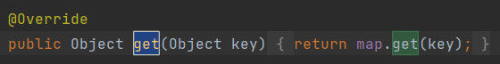
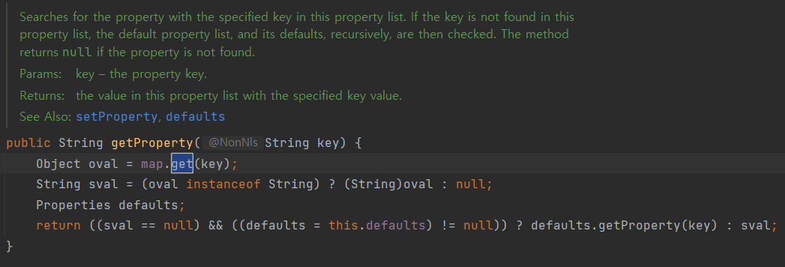
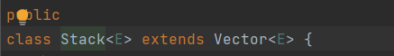
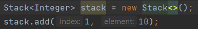

# java.util.Property extends Hashtable, java.util.Stack extends Vector 같은 클래스는 상속으로 망한 대표 사례입니다. 이유를 설명해 주세요.

두 경우 모두 상속을 통해 캡슐화를 깨트리고 있습니다. Property의 경우 HashTable의 기능을 다 사용할 수 있게 되면서 원래의 Property보다
더 많은 기능을 가지게 되었습니다. Properties는 키, 밸류로 문자열만 갖고 있지만, 상위 클래스인 HashTable을 통해 문자열 이외의 타입도 넣을 수 있게되었습니다.

또 사용에서도 헷갈리게 되었는데요, HashTable이 재정의한 `get()`과 Property가 제공하는 `getProperty()`가 서로 약간 다르게 동작하기 때문입니다.

스택 역시 비슷한데요, Vector를 상속받으며 Vector의 기능도 제공하게 되었습니다. 

그래서 이렇게 상속은 상위클래스와 강한 결합을 만들어내므로 조합을 이용합니다.
상속용으로 설계하지 않은 클래스는 명시적으로 상속을 금지하는 것도 한 방법입니다. 
