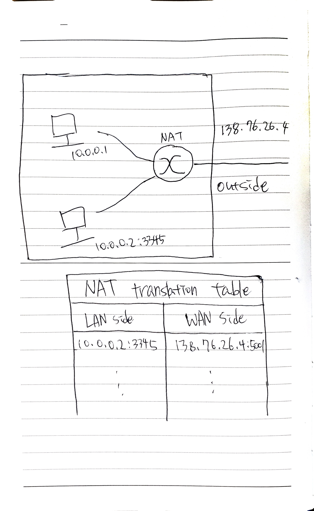

## NAT(Network Address Translation)에 대해 설명해주세요.

NAT는 IPv4 체계에서의 주소 고갈 문제를 해결하기 위해 도입된 기술입니다.

서브넷 내부의 컴퓨터는 같은 서브넷 내부에서는 유일하지만, 네트워크 전체로 볼 때는 유일하지 않은 IP를 할당받습니다.

NAT 기능을 하는 라우터는 서브넷에서 나가는 요청의 IP Address와 Port 번호를 수정하여, NAT 테이블에 매핑한 후 Outbound로 보내게 됩니다.

문제 1. Layer Violation

Internet Layer에서 Transport Layer의 데이터를 수정하는 Layer Violation 문제가 있습니다.

문제 2. 외부에서 서브넷 안의 컴퓨터의 프로세스를 식별할 수 없음.

NAT 기능을 하는 라우터가 인바운드 요청의 port를 Host를 식별하는데 사용하기 때문에 외부에서는 포트를 식별할 수 없습니다.

해결법

1. 공유기 포트포워딩
2. 가상 네트워크 구성

