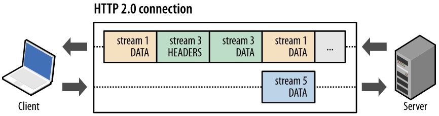

## 차세대 프로토콜로 논의중인 HTTP/3 은 UDP 기반의 QUIC 이라는 기술로 구현되어 있습니다. UDP 는 TCP 대비 안정성이 떨어지는 프로토콜이라고 하는데, 그럼에도 왜 UDP 를 채택한 걸까요?

우선 안정성이 떨어진다는 말을 제대로 이해해야하는데, 안정성이 떨어진다는 말은 신뢰성을 보장하지 않는다는 말입니다. TCP는 패킷을 받으면 패킷을 잘 받았다는 피드백을 보냅니다.
만약 일정 시간이 지나도 잘 받았다는 피드백이 없으면 상대쪽에서 패킷을 재전송하게 됩니다. 이 때문에 TCP를 사용하여 통신을 하는 경우에는 내가 보낸 메시지가 온전히 잘 도착했는지 걱정하지 않아도 됩니다.

반면 UDP는 이런 피드백 절차가 없습니다. 내가 보낸 메시지가 온전히 잘 도착했는지에 대해서는 관심이 없습니다. 따라서 전화나 비디오 스트리밍처럼 패킷 몇 개가 유실되어도 큰 문제가 되지 않는 경우가 아니라면 TCP를 사용할 수밖에 없습니다.

하지만 신뢰성 보장을 위해 필연적으로 레이턴시를 희생하게 됩니다. 또한 TCP는 Congestion control을 위해 slow start를 하기 때문에 생성된지 얼마 안된 connection은 bandwidth가 작은 문제가 있습니다.

QUIC은 이런 TCP의 근본적인 문제를 피하기 위해 UDP를 택하고 신뢰성 보장을 전송 계층이 아닌 애플리케이션 계층에서 수행함으로써 레이턴시도 줄이고 신뢰성도 보장할 수 있도록 만든 프로토콜입니다.

HTTP2가 멀티플렉싱을 통해 레이턴시를 낮췄지만 TCP를 기반으로 하기 때문에 피할 수 없는 근본적인 문제가 TCP의 Head Of Line Blocking 문제입니다.

HOL blocking이란 하나의 패킷이 중간에 유실되면 뒤 순서의 패킷들은 앞의 패킷이 다시 재전송될 때까지 blocking되는 문제를 말합니다.

하나의 TCP 커넥션을 이용해 통신하면 서로 다른 stream이라도 패킷 하나가 유실되면 뒤에 패킷들은 모두 blocking됩니다.

 

QUIC은 반면 패킷이 유실되어도 같은 stream의 패킷이 아니라면 blocking 되지 않고 처리될 수 있습니다.

### 참고자료

[HTTP 1.x / 2](https://donggov.tistory.com/187)
[HTTP 3 and QUIC](https://donggov.tistory.com/188)
[TCP HOL Blocking](https://http3-explained.haxx.se/ko/why-quic/why-tcphol)
[TCP HOL Blocking](https://stackoverflow.com/questions/45583861/how-does-http2-solve-head-of-line-blocking-hol-issue)
