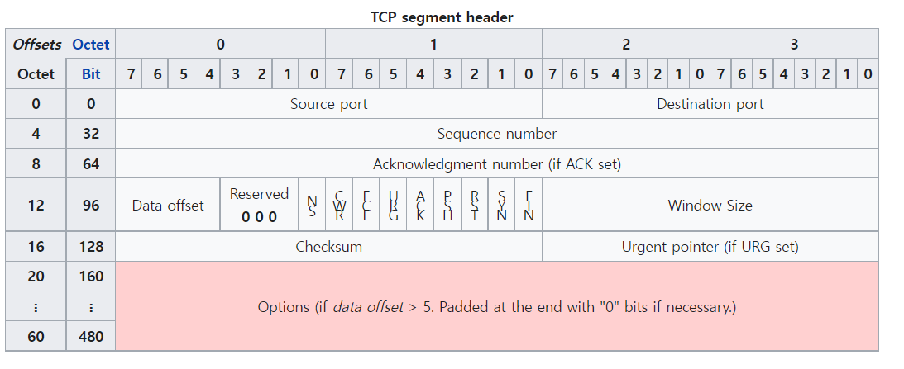

# TCP와 UDP의 차이점에 대해서 설명해보세요

TCP와 UDP 모두 Transport Layer에서 사용되는 프로토콜입니다. 

## TCP (Transmission Control Protocol)
TCP는 신뢰성있는 데이터를 전송합니다. TCP는 연결지향형이기 때문에 데이터의 송신측과 수신측이 서로 연결되는 작업이 필요합니다. 
이를 3 Way handshaking이라고 부릅니다. 또 TCP는 데이터의 순차 전송을 보장하며, 흐름 제어, 혼잡제어, 오류감지 기능이 있습니다. 

이렇게 TCP의 header에는 메타데이터들이 들어가는데, TCP 방식에서는 데이터를 전송한 후 ACK을 받지 못하면 데이터를 재전송 하는 방식으로 
데이터의 전송을 보장할 수 있게 됩니다. 

이렇게 신뢰성은 보장할 수 있지만 매번 Connection을 연결해서 성능적 손실도 있습니다. 

## UDP (User Datagram Protocol)
UDP는 TCP보다 신뢰성은 떨어지지만 전송 속도가 빠른 프로토콜입니다. 
UDP는 순차전송, 흐름제어, 혼잡 제어 기능을 제공하지 않으며 비연결지향입니다. 

그래서 데이터가 완벽하게 전송되지 않아도 큰 오류가 발생하지 않는 곳에서 사용되는데요, 일반적으로 영상 스트리밍 혹은 게임 쪽에서 많이 사용됩니다. 
또 HTTP3 역시 UDP를 이용하여 만들어졌습니다. 

# 질문
## 3-way-handshaking
TCP header에는 데이터의 상태를 나타내기 위한 비트 공간들이 있다. 이 비트를 이용해서 메시지를 전달한다. 
Client -> Server: SYN
Server -> Client: SYN ACK
Client -> Server: ACK

여기서 SYN은 Synchronize squence numbers, ACK은 Acknowledgment를 뜻한다.

## TCP에서 오류 감지
TCP 헤더에 체크섬을 함꼐 보낸다. 송신자는 데이터를 알고리즘에 의해 계산한 체크섬을 보내고, 수신자는 동일한 알고리즘으로 받은 데이터의 체크섬을 구해서 비교해본다.
이때 데이터를 잘 받았으면 ACK, 못받았으면 NACK을 보낸다. 

수신측에서 송신측으로 NAK을 보내거나, ACK이 오지 않으면 송신측에서 오류를 인지하고 대응한다. 
