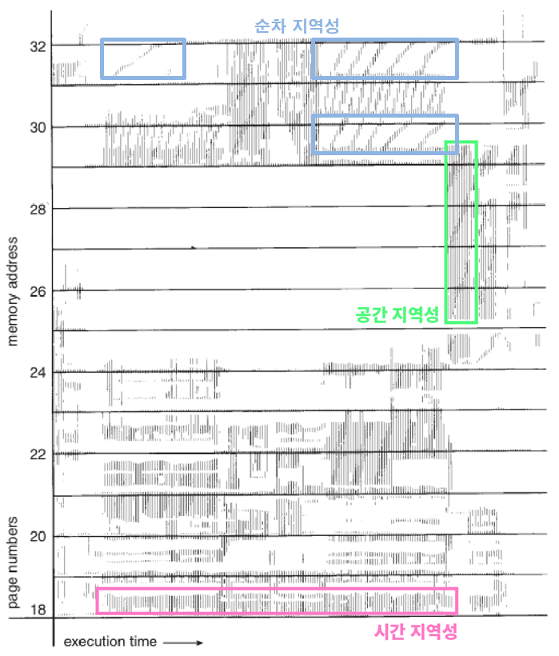

# 캐시의 지역성에 대해 설명해주세요

CPU가 미래에 필요한 데이터를 예측하여 속도가 빠른 장치인 캐시 메모리에 담아 놓는데 이때 예측률을 높이기 위해 사용하는 원리다.
캐시의 지역성에는 `시간 지역성`과 `공간 지역성`이 있다.
시간 지역성이란 최근에 참조한 메모리는 또 참조될 가능성이 높다는 것이고, 공간 지역성은 한번 사용된 데이터의 주변 데이터들까지 곧바로 사용될 가능성이 높다는 의미이다.
따라서 한번 데이터가 사용될 때 해당 데이터의 주변 데이터들까지 캐시 메모리에 적재된다.



1. 배열
```java
int[][] array = {{1, 2, 3 ...}, {4, 5, 6...}};
int sum = 0;

for (int i = 0; i < array.length; i++) {
    for (int j = 0; j < array[0].length; j++) {
            sum += array[i][j];
        }
}


for (int j = 0; j < array.length; j++) {
    for (int i = 0; i < array[0].length; i++) {
        sum += array[i][j];
    }
}
```

같이 2차원 배열을 반복하는 코드라도 첫번째 방식으로 짜는 것이 더 성능면에서 유리할 수 있습니다. 배열은 연속된 공간에 할당되는 동일한 크기의 데이터들의 모음이기 때문에 캐시의 공간지역성을 잘 활용할 수 있습니다.

2. LinkedList vs ArrayList
   마찬가지 이유로 같이 데이터를 조회하는 작업을 하는 것이라면 ArrayList를 이용하는 것이 캐시의 지역성을 활용하기 때문에 더 유리할 수 있습니다.

3. Sorting
   Heap Sort, Merge sort, Quick sort 전부 평균 O(nlogn)의 빠른 알고리즘으로 알려져있습니다.
   하지만 실제로는 성능상의 차이가 나는데요, heap sort는 참조 지역성이 좋지 않은 대표적인 정렬입니다. 한 위치에 있는 요소를 해당 인덱스 두 배 또는 절반인 요소와 반복적으로 비교하기에 캐시 메모리에서 예측하기가 매우 어렵습니다.
   Merge sort의 경우 인접한 블록들을 병합하기에 참조 지역성의 원리를 어느정도 만족하고, Quick sort의 경우 pivot 주변에서 데이터의 위치 이동이 빈번하게 발생하기에 참조 지역성이 좋습니다.
